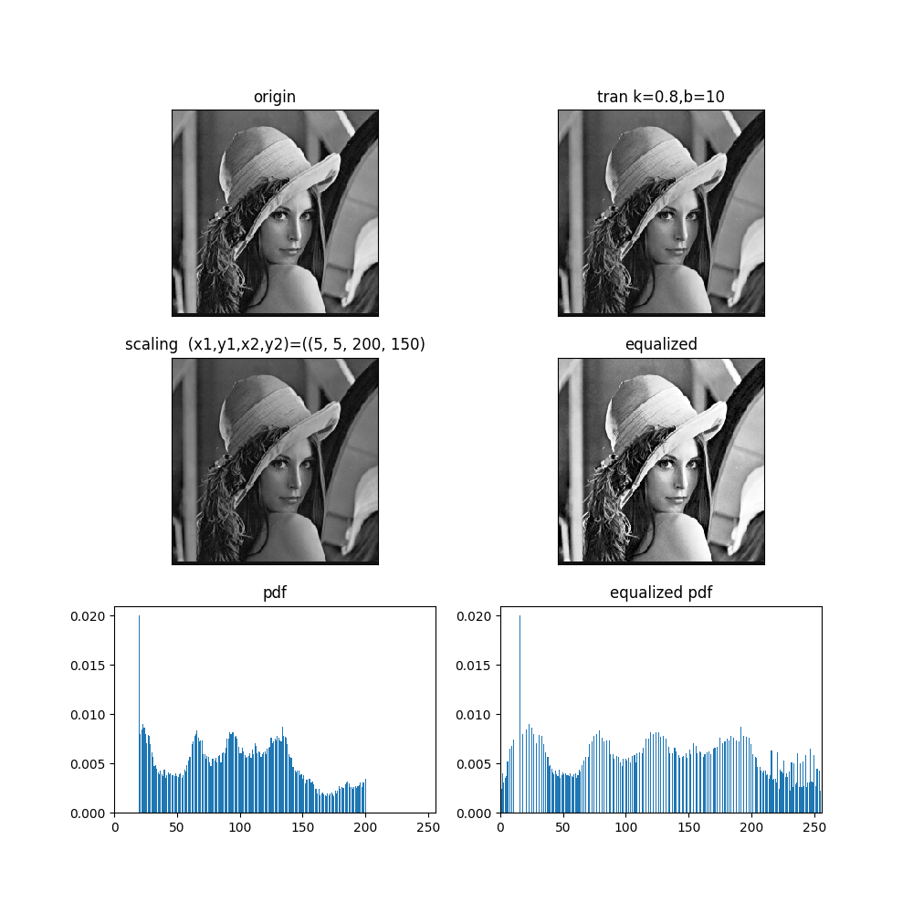
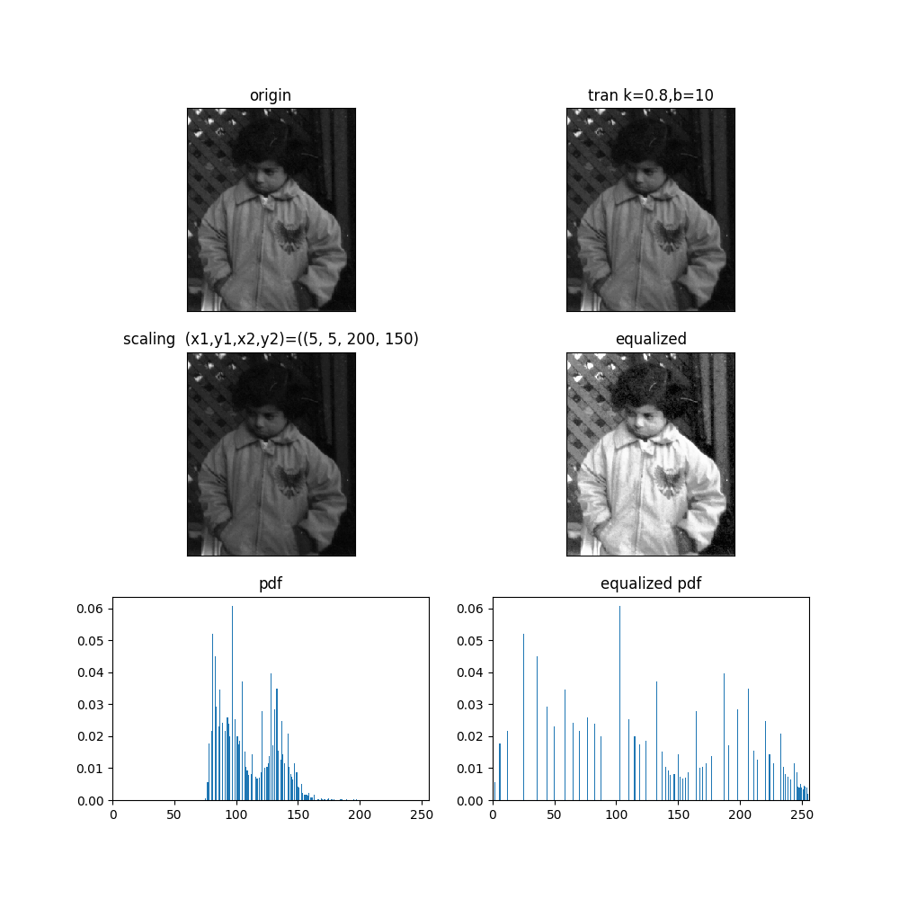
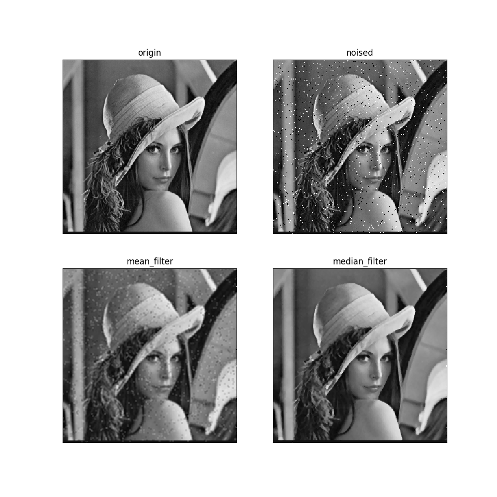
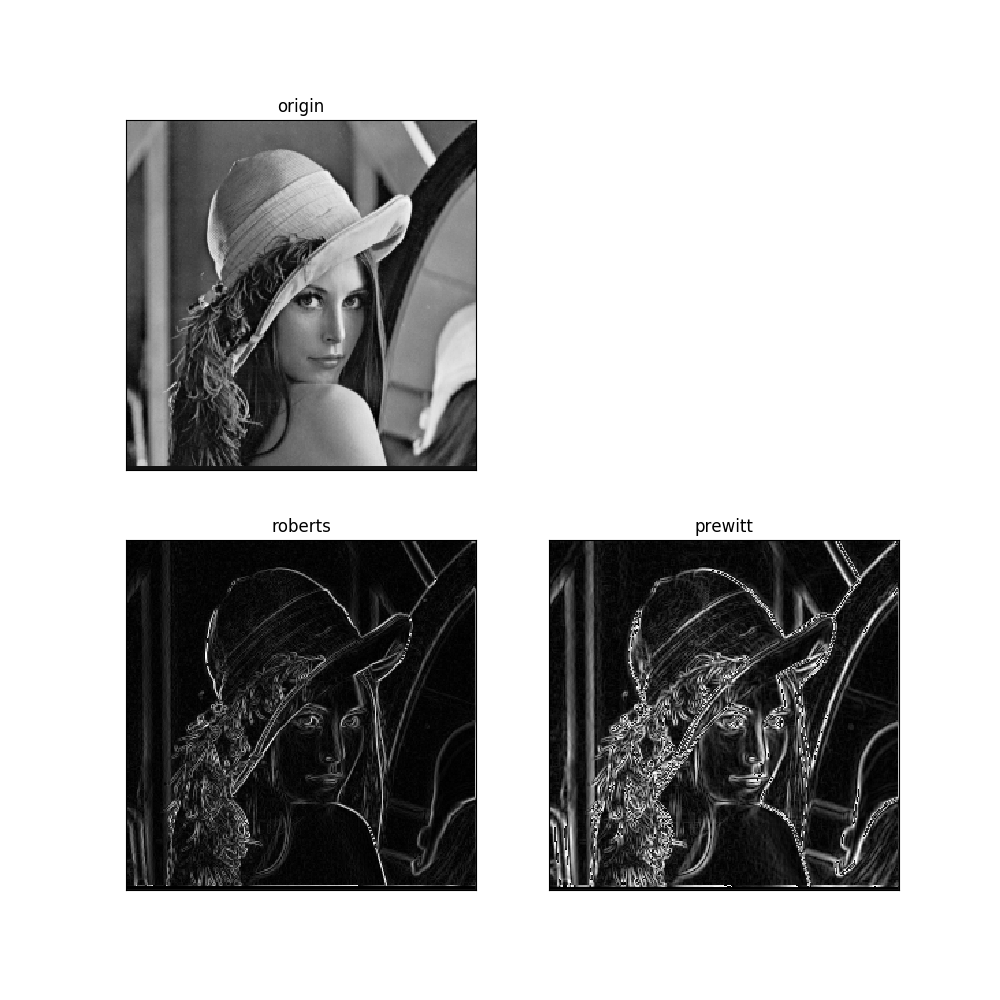
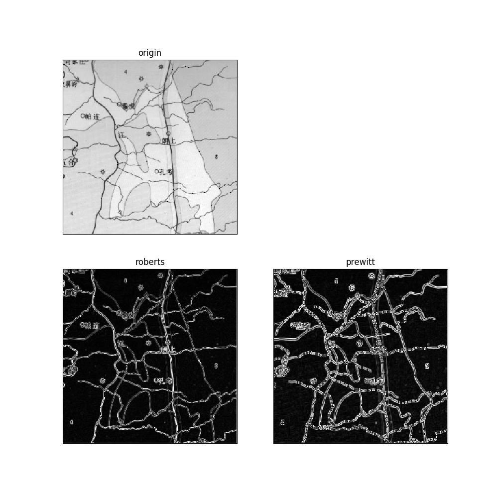
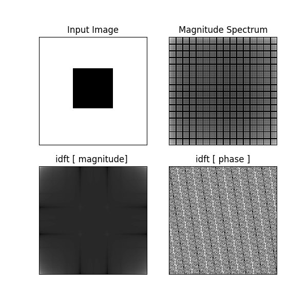
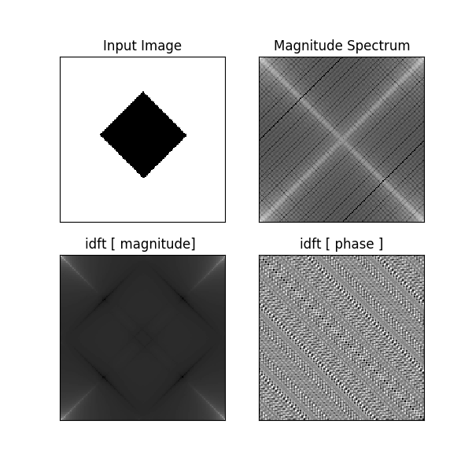

<!--  style=flat/plastic/social,  label force to change the title -->
# <div align="center">2019 计算机图像学实验  </div>
[](LICENSE)
[](.)

>说明. 最开始我用的 cpp 实现了实验内容(代码在 `cpp`目录下），以及自己实现了 fft, 1d,2d。但是配置 windows上的 opencv 环境失败，代码只经过了静态语法检测，可能还有些地方有 bug。 后来我用的 python 重新实现了除 FFT 的所有算法，并将结果记录如下

## 使用
### 环境
- python3.6+
- matplotlib
- numpy
- cv2

### 运行
当前目录下的所有 python 代码按如下格式执行
`python3 lab*.py <IMG_PATH>`
如
`python3 lab1.py images/lena.bmp`


# 实验内容
## 图像的点处理
### 灰度的线性变换
输入斜率，截距， 进行一维线性变换

### 灰度拉伸
输入两个转折点(x1,y1),(x2,y2), 进行分段的线性变换
```
当 x<x1, f(x) = y1/x1*x
当 x1<=x<=x2, f(x) = (y2-y1)(x-x1)/(x2-x1)+y1
当 x>x2, f(x) = (255-y2)*(x-x2)/(255-x2)+y2
```

### 灰度直方图
输入图像，显示它的灰度直方图, 还可以输入恢复的上限，下限， 显示这个范围内的灰度直方图

### 直方图均衡
扩大灰度范围，减少灰度之间的数量差值


结果如下




## 数字图像的平滑
滤波，去除图像的噪声,均值滤波，中值滤波去除加性噪声；同态滤波去除乘性噪声

先给图像加上 3% 的椒盐噪声，然后分别使用 窗口大小为 3 的均值滤波器和中值滤波器进行滤波


记图像大小 nxm, 窗口大小为 wxw
我在实现滤波器时，移动窗口，每次只会更新移进的值，和移出的值。
即 窗口先又移动，每移动一列，就将这列的数据考虑进来，而将移出的那一列剔除。这样在更新窗口的值时只需 O(w)

对于均值滤波，时间复杂 O(nmw)
对于中值滤波，需要求出中值，则这需要 O(w^2) 的时间才能完成。可以利用 快速选择的算法，在O(lengthOfArray) 时间里找出排任意名次的数，这里找出中值, w\*w/2
总时间复杂度 O(nmw^2)

结果如下



## 图像的边缘检测
实验原理： 

在灰度图像的情况下，所谓的边缘检测可以看成是基于图像像素灰度值在空间的不连续性对图像做出的一种分割。边缘可以用方向和幅度两个特性来描述。一般而言，沿边缘走向方向其幅度值变化较平缓，而沿垂直于边缘走向其幅度值变化较剧烈。 

经典的边缘提取方法是考察图像的每个像素在某个邻域内灰度的变化，利用边缘邻近一阶或二阶方向导数变化规律，用简单的方法检测边缘。这种方法称为边缘检测局部算子
法。 

边缘检测算子一般有
- Roberts 交叉算子
- Sobel 模板卷积
- Prewitt 同上
- Laplace 

我实现的时 Roberts, Prewitt， 结果如下



## 傅里叶变换
有时间可以专门写一篇介绍 Fourier 变换

实验要求
- 对 `images/rect*` 图像作二维Fourier , 显示频谱，然后作幅度变换，将低频移到中心点
- Fourier 反变换 幅度，并显示
- Fourier 反变换 相位，并显示

结果如下


